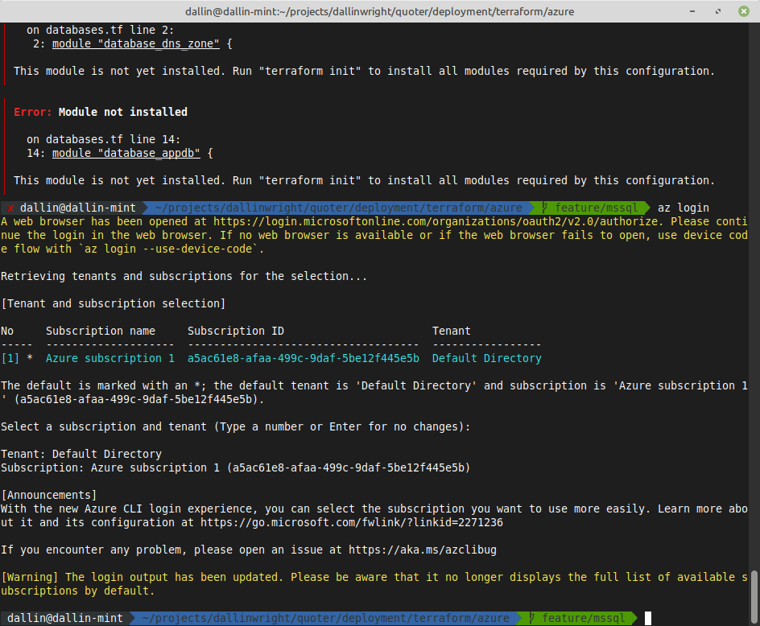
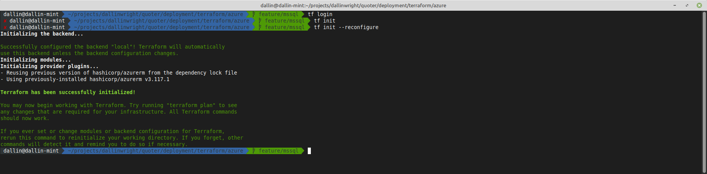
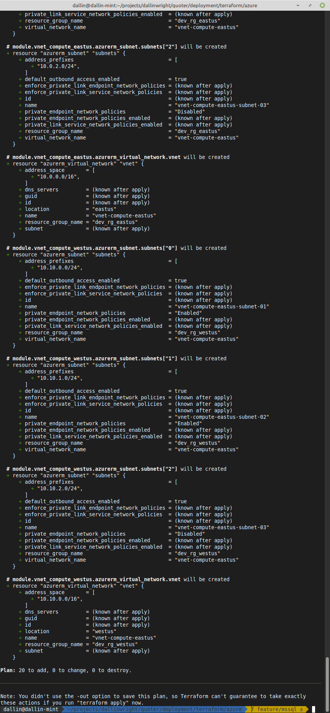

# Terraform Deployment

This is a sample of how you could deploy. In the real world, this would
have versioned external modules that are not local or directly referenced.

For example, you would have a library of modules in github or via the opinated Terraform Cloud approach of a registry
repository per module like this.

### Disclaimer

This is a small demo to show the usage. Lots of things are missing, for example, using a pipeline, automated controls,
lints, formatting checks, policy checks, etc. are not included. Also you would not include the actual infrastructure in
this repo, but rather use a separate repo for the use case and Org, but for the demo and for the given instructions I
included it here.

### Modules

Example using a versioned module from the Terraform registry, either the cloud registry or a private registry.

```terraform
module "network" {
  source  = "Azure/network/azurerm"
  version = "3.5.0"  # pinned module version
  # source  = "git::https://github.com/Azure/terraform-azurerm-vnet.git?ref=v3.2.0" as an alternative

  resource_group_name = "rg-example"
  location            = "eastus"
  address_space = ["10.0.0.0/16"]
}
```

### Directory Layout

#### Why the specific layout?

##### Balance between flexibility, scalability, simplicity and time constraint.

It's a compromise between flexibility, scalability, simplicity and the time constraint. Having versioned independent
modules
is a good idea, but it's not always practical.

##### Directory per cloud provider.

To demonstrate multiple workspaces and separate isolated states, a specific Azure folder for the cloud infrastructure is
used.
Using the current approach you would then for example have a `github`, `cloudflare`, `auth0`, etc. folders per cloud
provider
and then split the environments into separate workspaces.

##### State file gotchas.

The reason is that Terraform evaluates the state file sequentially, and on every plan it must evaluate the declared
state against the target state. This also means if all state is in a single file, and you have thousands of resources,
it can take hours to do a single plan, assuming no errors, state drift, etc. and it must be done every single time. This
is not practical, scalable, maintainable or efficient. The current approach is again is to demonstrate the idea, but to
not go too far by splitting it to the team, env, platform, etc. level which would be too far in the other direction as
well for the given challenge.

### Usage

#### Azure CLI Login

First, make sure you have the Azure CLI installed and logged in via `az login`. You will have output similar to this if
successful.

```bash
cd deployment/terraform/azure
```



Assuming all goes well, you are logged in via credentials now locally cached. You can either run `terraform init` as it
currently stands to use local file state, or preferably uncomment the `backend.hcl` file contents and use a remote
backend for example the Azure Storage backend as shown in that file.

Note, AWS requires DynamoDB for state locking coordination in distributed environments and for pipelines (or used to)
whereas Azure Blob Leases handle this automatically.

#### Create and switch to a workspace

A workspace is a logical section in the state to seperate typically by environment. You now use the same config for 3
environments which is less maintenance.

```bash
terraform workspace new dev
terraform workspace select dev # or prod
```

#### Initialize the backend

Authenticate and create empty state file in the Azure Storage account.

```bash
terraform init -backend-config=./envs/dev/backend.hcl
```



#### Plan the changes

Terraform will show you the changes that will be made.

```bash
terraform plan --var-file=./envs/dev/values.tfvars
```



### Conclusion

I left it here to show the workflow, I did not actually apply the changes as I did not want to incur actual costs and
provision the infrastructure live in the cloud as the SQL setup, instances, etc. are not free.
